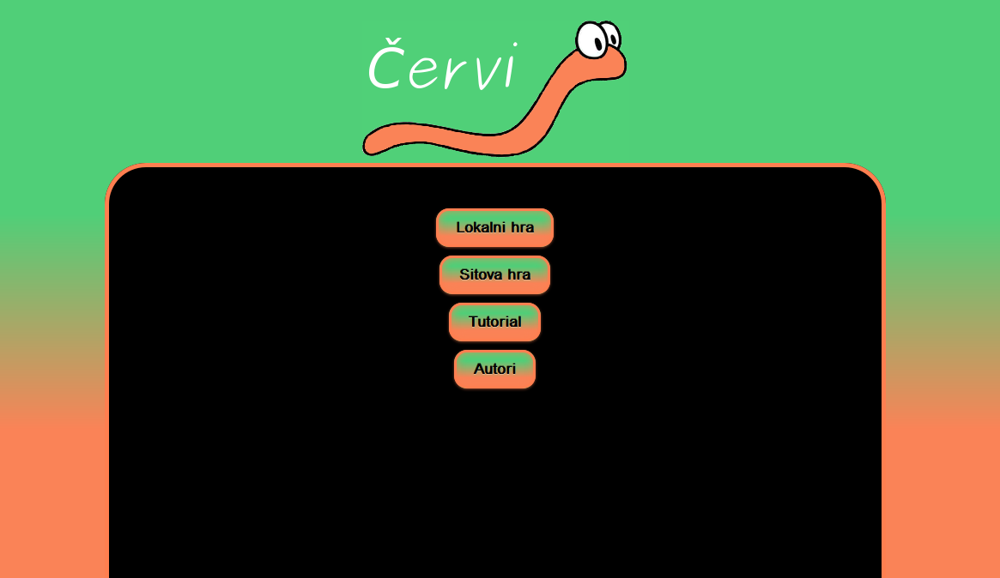
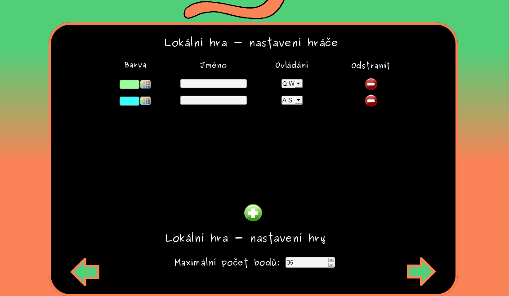
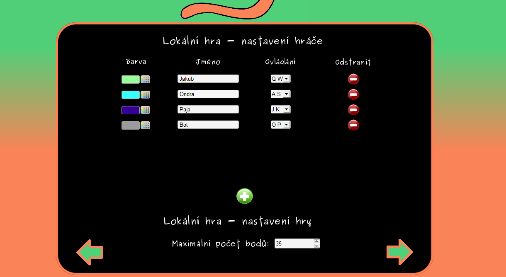
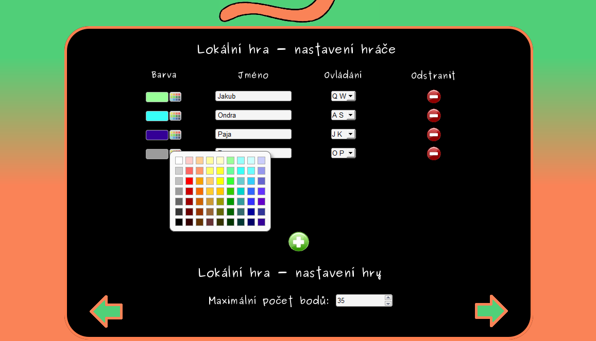

#DieCurve (Cervi)
Local javascript copy of Curve Fever created as school project.
It was during our first days so everything is in Czech, but still you will be able to play.

Run cervi.html to start and click on first button 'Lokalni hra'. 

Created in November 2012.

## Authors
* Ondrej Cienciala
* Paja Bartikova
* Jakub Kvita - kvitajakub@gmail.com

## Application gallery

